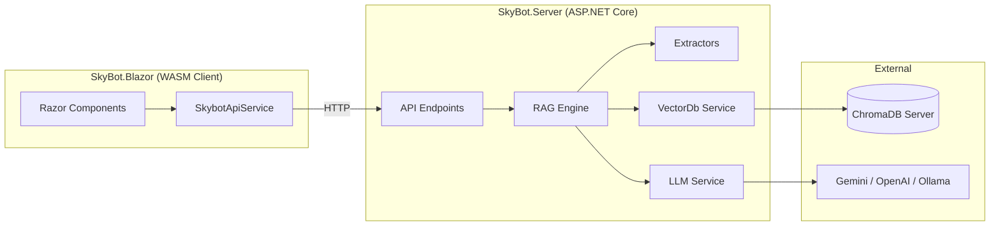

# Dir tree
```
Skybot/
├── SkyBot.Server/                 ← [NEW] ASP.NET Core API (replaces Python)
│   ├── Program.cs                 ← API endpoints + CORS + DI
│   ├── appsettings.json           ← Config (replaces .env)
│   ├── Services/
│   │   ├── LlmService.cs          ← Multi-provider LLM (Gemini/Ollama/OpenAI)
│   │   ├── VectorDbService.cs     ← ChromaDB client wrapper
│   │   ├── RagEngine.cs           ← Retrieval + generation (replaces retrieval.py)
│   │   └── IngestionPipeline.cs   ← Ingest + chunk + embed (replaces ingestion.py)
│   ├── Extractors/
│   │   ├── IExtractor.cs          ← Interface (replaces base.py)
│   │   ├── PdfExtractor.cs
│   │   ├── DocxExtractor.cs
│   │   ├── PptxExtractor.cs
│   │   ├── XlsxExtractor.cs
│   │   ├── CsvExtractor.cs
│   │   ├── HtmlExtractor.cs
│   │   └── TextExtractor.cs
│   └── Models/
│       └── ContentItem.cs
├── SkyBot.Blazor/                 ← WASM frontend
│   └── Program.cs               
└── SkyBot.Shared/                 ← Shared DTOs
    └── Models/
        ├── ChatRequest.cs
        ├── ChatResponse.cs
        ├── IngestResponse.cs
        └── ChannelList.cs
```

# Skybot
SkyBot is a modern, multimodal Retrieval-Augmented Generation (RAG) system designed specifically for Semiconductor Manufacturing Assistance. 
It features a robust ASP.NET Core backend that supports multiple LLM providers, paired with a fast, responsive Blazor WebAssembly frontend.

## Architecture Overview
SkyBot is divided into three main components:

- **SkyBot.Server**: The core ASP.NET API backend (replacing the previous Python implementation). Handles ingestion, RAG logic, external API integrations, and VectorDB interactions.
- **SkyBot.Blazor**: The Blazor WebAssembly (WASM) frontend, providing a rich, interactive user experience.
- **SkyBot.Shared**: Shared Data Transfer Objects (DTOs) utilized by both the Server and Blazor client to ensure type safety.



## Infrastructure & Core Logic

### 1. Multi-Provider LLM Integration (`LlmService.cs`)
SkyBot abstracts the AI model interactions, allowing developers to seamlessly switch between multiple backends:
- **Gemini**: Used for advanced multi-modal tasks, including complex reasoning and image analysis.
- **Ollama**: Allows running local, open-source models (ex: Qwen) for cost-efficiency and privacy.
- **OpenAI**: Integrated as an additional high-tier backend (ex: GPT).

### 2. Document Ingestion Pipeline (`IngestionPipeline.cs`)
The custom ingestion engine extracts data from diverse document types and prepares it for semantic search:
- **Supported Formats**: PDF, DOCX, PPTX, XLSX, CSV, TXT, HTML, etc.
- **Text Processing**: Text is parsed and split using a recursive chunking strategy (defaulting to 1000-character chunks with a 100-character overlap) to maintain contextual integrity.
- **Vision-Language Model (VLM) Analysis**: When processing documents with images or CAD diagrams, the system extracts the images and passes them to a VLM (such as Gemini or Ollama). The VLM identifies diagram types, extracts visible text/labels, and generates concise descriptions. Both the extracted images and their rich text metadata are then embedded into ChromaDB.

### 3. RAG Engine (`RagEngine.cs`)
When a user submits a query:
- **Context Retrieval**: The query is embedded and searched against `ChromaDB`. Results can be optionally filtered by predefined channels.
- **Hybrid Image Retrieval**: If the retrieved text chunks reference specific pages containing images or diagrams, the engine performs a secondary lookup to pull the corresponding image files.
- **Answer Generation**: The LLM compiles the retrieved text context and images. Custom system instructions enforce that the LLM prioritizes any provided images over textual descriptions.
- **Citation & Rendering**: Responses explicitly include inline embedded images and clickable hyperlinks mapped to the exact page of the original documents `(e.g., 📄 Document — Page X)`.

## Configuration (`appsettings.json`)
The system is configured via `appsettings.json` (replacing the `.env` file). Below is an example structure:

```json 
{
  "Llm": {
    "Provider": "gemini",
    "Gemini": { "ApiKey": "...", "Model": "gemini-3.1-pro-high", "Endpoint": "..." },
    "Ollama": { "Model": "qwen3-vl:4b" },
    "OpenAI": { "ApiKey": "...", "Model": "gpt-4o", "Endpoint": "..." }
  },
  "ChromaDb": { "Endpoint": "http://localhost:8100", "CollectionName": "semicon_knowledge_base" },
  "EnableVlmIngestion": true
}
```

## Getting Started

### Prerequisites
- $>=$ .NET 8.0 SDK
- ChromaDB running locally or remotely
- API Keys for your preferred LLM provider

### Usage Instructions

1. **Start ChromaDB**: 
```bash
chroma run --host 0.0.0.0 --port 8100 --path ./chroma_db
```

2. **Start the Backend API**: 
```bash
cd SkyBot.Server
dotnet run --urls "http://localhost:5000"
```

3. **Start the Blazor Frontend**: 
```bash
cd SkyBot.Blazor
dotnet run
```
